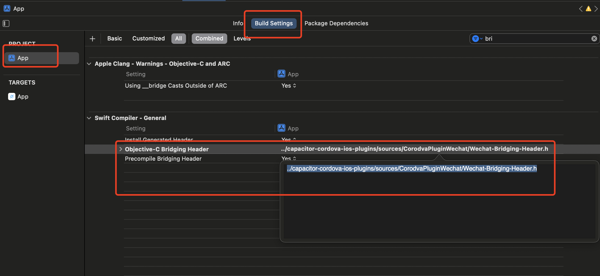

# 快速开始


## 开始前的准备

- 注册[微信开放平台](https://open.weixin.qq.com/)，并申请移动应用；

- 如果需要支付功能，还需要申请[微信商户](https://pay.weixin.qq.com)；
- IOS项目请配置好UNIVERSAL LINK；
- 准备好的你项目（基于cordova）
- [获取](https://byteee.fund/project/cordova-plugin-wechat)代码并下载解压到本地；


## 开发环境

- Android Studio 

- Xcode
- Node
- Cordova


## 安装插件

### 本地安装

```shell
cordova plugin add ../本地插件目录 --variable APP_ID=你的微信APPID --variable UNIVERSAL_LINK=你的UNIVERSAL LINK链接
```

> 如果你的项目支持安卓，也可以不传入`UNIVERSAL_LINK `参数


## 移除插件

```shell
cordova plugin rm cordova-plugin-wechat --variable APP_ID=你的微信APPID
```


## Capictor/Ionic适配

```shell
npm install 本地插件目录
```


由于capacitor 不支持cordova插件的变量配置，需要手动进行适配

### 修改capacitor.config.json文件

```typescript
const config: CapacitorConfig = {
	// 其他配置
	...
	
	// cordova相关配置
	cordova: { 
    preferences: { 
      wechat_app_id: "wxc04a4b5e1607572b",
      wechat_universal_link: "https://xxx"
    } 
  },
  ios: {
    cordovaLinkerFlags: ["-ObjC", "-all_load"]
  }
  
}
```

### 修改IOS工程配置

[微信官方文档](https://developers.weixin.qq.com/doc/oplatform/Mobile_App/Access_Guide/iOS.html)

1、在 Xcode 中，选择你的工程设置项，选中“TARGETS”一栏，在“info”标签栏的“URL type“添加“URL scheme”为你所注册的应用程序 id（如下图所示）。


2、在Xcode中，选择你的工程设置项，选中“TARGETS”一栏，在“info”标签栏的“LSApplicationQueriesSchemes”添加weixin、weixinULAPI、weixinURLParamsAPI（如下图所示）。


3、原来的method swizzling在capactiro中无法监听回调，需要通过Bridging Header代码进行调用, 在APP targes 的 “Build Settings"里找到 "Objective-C Bridging Header", 输入

```
../../capacitor-cordova-ios-plugins/sources/CorodvaPluginWechat/Wechat-Bridging-Header.h
```





4、修改AppDelegate.swift

```swift
func application(_ application: UIApplication, continue userActivity: NSUserActivity, restorationHandler: @escaping ([UIUserActivityRestoring]?) -> Void) -> Bool {
        
        // 添加微信插件回调
        WechatAttribution.shared().continue(userActivity)
        return ApplicationDelegateProxy.shared.application(application, continue: userActivity, restorationHandler: restorationHandler)
    }
```


 
